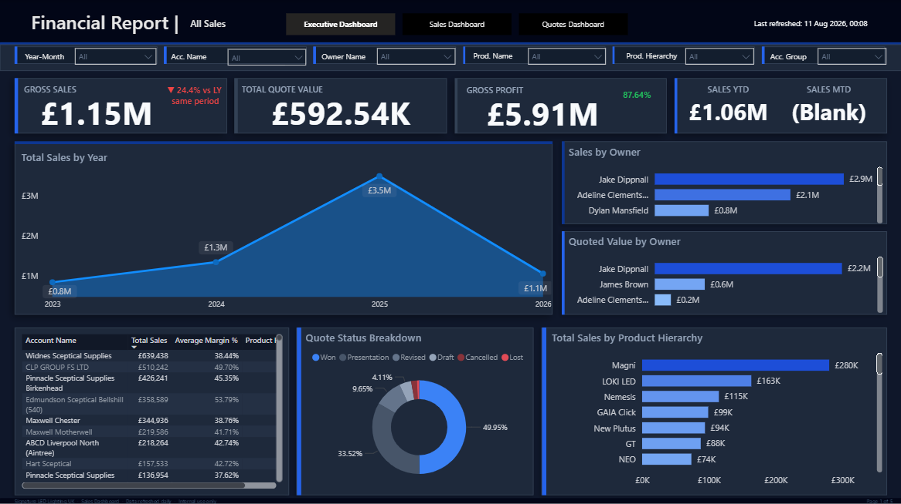
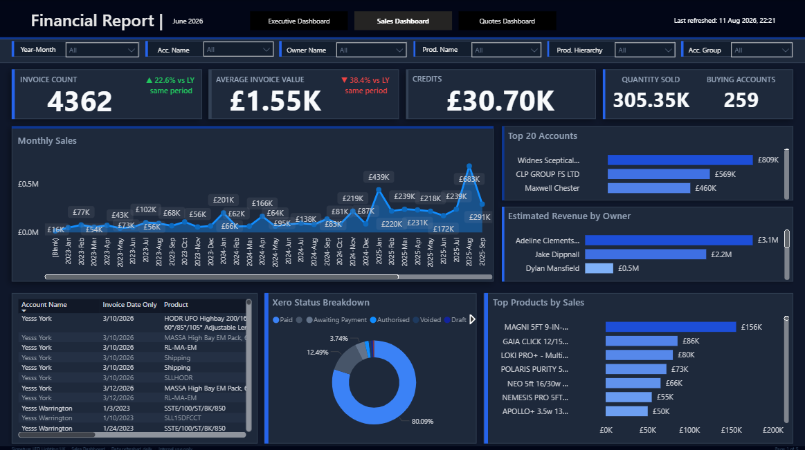
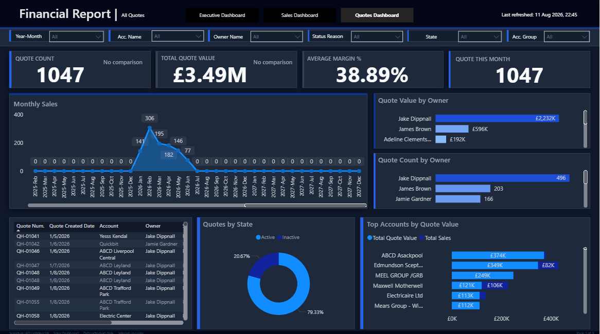

# Financial & Sales Reporting Suite

**Client:** UK-Based Lighting Company  
**Role:** Data Analyst / Power BI Developer  
**Status:** Completed

---

## Project goal

Build an automated, end-to-end Power BI reporting suite that delivers daily, trusted insights into true profitability, sales performance, and quote conversion—so leaders can act quickly and confidently.

## Key challenges

- Siloed data across Dynamics 365, Xero Accounting, and Excel files (SharePoint) that prevented a single source of truth.
- Dynamics 365 restricted useful data behind complex view forms, blocking standard table extraction.
- True net profit was obscured because credit notes lived separately in Xero and Excel and required manual adjustments.
- No role-based reporting: executives and operational teams lacked tailored views and had no visibility into data currency or refresh times.

## Data architecture & integration (what I built)

- **Tri-source pipeline:** Integrated Dynamics 365, Xero, and Excel (SharePoint) into a single, refreshable Power BI model.
- **Custom API pagination for Dynamics 365:** Implemented a robust M / Power Query function with OData (odata.maxpagesize=5000) and dynamic pagination to fully extract datasets despite view limitations.
- **Relational data model:** Designed a clean model linking eight core tables—Accounts, Invoice History, Date, Opportunities, Products & Services, Code Headers, System Users, and Xero Credit Notes—so measures are accurate and performant.
- **Automated refresh & transparency:** Added a visible “Last Refreshed” timestamp (example: 11 Aug 2026, 22:21) so users know when data was last updated.

### Executive Dashboard

### Sales Dashboard

### Quotes Dashboard

---

## The solution — three focused dashboards (impact-first)

### 1) Executive Dashboard

- **Purpose:** Provide a single, auditable view of true net profit by programmatically pulling live Xero data and automatically applying credit-note adjustments.
- **Key features:** Custom DAX measures for Year-over-Year (YoY) percentage changes, clear conditional formatting to surface risks and wins.
- **Business impact:** Eliminated manual profit adjustments and gave finance and leadership a trusted, repeatable net-profit number for faster decision-making.

### 2) Sales Dashboard

- **Purpose:** Monitor sales volume and value with operational detail for sales owners and managers.
- **KPIs & examples:** Invoice Count (4,362), Average Invoice Value (£1.55K), Total Credits (£30.70K).
- **Key features:** Top 20 accounts and top products by sales, account-owner performance timelines, and a Xero Status Breakdown donut chart showing payment health (Paid, Awaiting Payment, Authorised, Voided, Draft—> >80% paid).
- **Business impact:** Identified top revenue drivers so the sales organization can prioritize high-value accounts, improve collections, and refine forecasts.

### 3) Quotes Dashboard

- **Purpose:** Give a clear view of the quote pipeline and conversion performance.
- **KPIs & examples:** Quote Count (1,047), Total Quote Value (£3.49M), Average Margin (38.89%).
- **Key features:** Quote state breakdown (Active vs. Inactive), monthly quote trends, breakdowns by owner and account, and top accounts by quote value.
- **Business impact:** Improved pipeline hygiene, helped focus efforts on high-value opportunities, and boosted conversion visibility.

---

## Deployment, security & administration

- **Cloud deployment:** Published the report to Power BI Service and managed gateway connections for secure scheduled refreshes.
- **Access control:** Implemented Row-Level Security (RLS) to ensure users see only the data they are entitled to.
- **Automation:** Scheduled refreshes and set up executive email subscriptions (daily 9:00 AM snapshots) to deliver timely insights automatically.
- **Transparency:** Visible “Last Refreshed” timestamp gives end users confidence in data currency.

---

## Business impact — measurable improvements

- Removed manual data extraction and ad-hoc profit calculations by automating the entire pipeline.
- Delivered role-based reporting across executives, sales, and quoting teams—improving situational awareness and speeding decisions.
- Increased executive engagement with daily automated snapshot emails, resulting in more timely, data-driven actions.

---

Regards,

Muhammad Rizwan Khan
